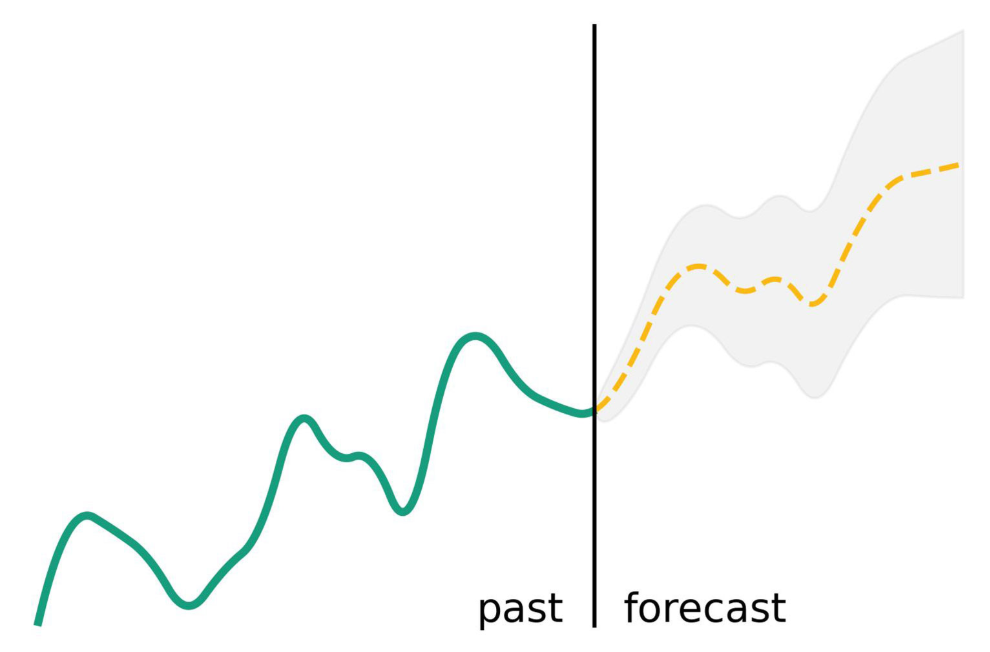
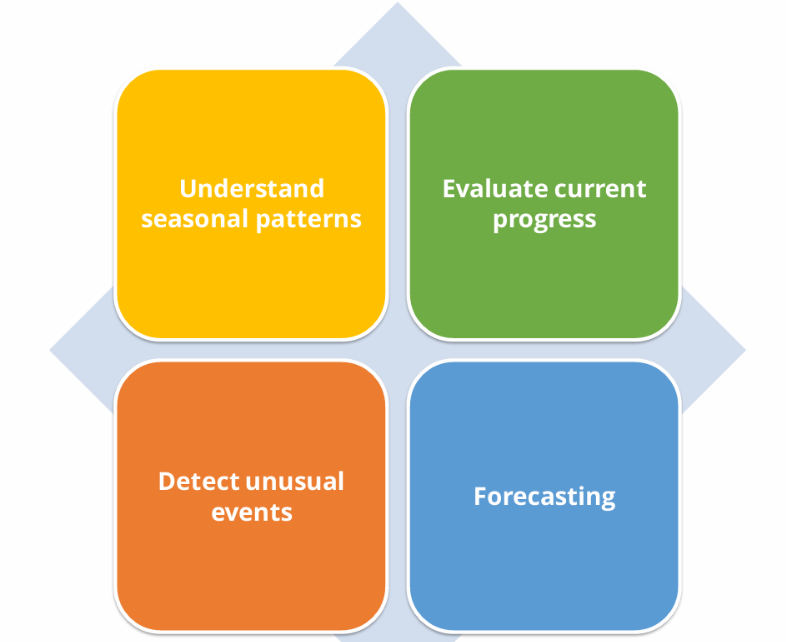

# 01 — What is Time Series Data?

> **Module**: 01 Foundations | **File**: 1 of 5
>
> Build a precise understanding of what time series data is, how it differs from other data types, and the full landscape of problems you can solve with it.

---

## Table of Contents

1. [Definition](#1-definition)
2. [Real-World Examples](#2-real-world-examples)
3. [Time Series vs. Cross-Sectional Data](#3-time-series-vs-cross-sectional-data)
4. [Types of Time Series](#4-types-of-time-series)
5. [The Time Series Problem Landscape](#5-the-time-series-problem-landscape)
6. [Key Terminology](#6-key-terminology)

---

## 1. Definition

A **time series** is a sequence of observations recorded **at successive, ordered points in time**.



```
Formal definition:
  A time series is a collection of random variables {Y_t}
  indexed by time t ∈ T, where T is an ordered set
  (e.g., t = 1, 2, 3, ..., T  or  t = 2020-01-01, 2020-01-02, ...)
```

**Three critical properties that define time series data:**

1. **Temporal ordering** — The sequence of observations matters. Shuffling rows destroys meaning.
2. **Serial dependence** — Observations are correlated with each other across time (today depends on yesterday).
3. **Time index** — Every observation is tied to a specific timestamp.

---

## 2. Need of timeseries




### Real-World Examples

| Domain | Time Series | Typical Frequency |
|--------|-------------|-------------------|
| **Finance** | Stock price, trading volume, exchange rates, interest rates | Tick, minute, daily |
| **Energy** | Electricity demand, solar generation, gas consumption | Hourly, 15-min |
| **Retail** | Daily sales, website traffic, inventory levels | Daily, weekly |
| **Healthcare** | ECG signal, blood pressure, patient vitals | Millisecond, hourly |
| **Climate** | Temperature, rainfall, CO₂ concentration | Daily, monthly |
| **IoT / Manufacturing** | Sensor readings, CPU usage, machine vibration | Millisecond, second |
| **Economics** | GDP, inflation, unemployment rate | Monthly, quarterly |
| **Transportation** | Traffic volume, flight delays, ride-sharing demand | Minute, hourly |


---

## 3. Time Series vs. Cross-Sectional Data

This is the most fundamental distinction every AI engineer must internalize.

| Property | Cross-Sectional Data | Time Series Data |
|----------|----------------------|------------------|
| Row order | **Irrelevant** | **Critical** |
| Row independence | Rows are i.i.d. | Rows are **correlated** with neighboring rows |
| Train/test split | Random split is fine | Must **respect time order** |
| Standard ML models | Directly applicable | Requires adaptation |
| Leakage risk | Low | **Very high** |
| Feature engineering | Independent of position | Lag, rolling window features needed |
| Cross-validation | k-fold is valid | k-fold is **invalid** — use TimeSeriesSplit |

### ⚠️ The Most Common Mistake

Applying **random train/test splits** to time series data. This leaks future information into the training set and produces falsely optimistic evaluation results.

```python
# ❌ WRONG — Do NOT do this for time series
from sklearn.model_selection import train_test_split
X_train, X_test = train_test_split(X, test_size=0.2, random_state=42)

# ✅ CORRECT — Always split by time
split_idx = int(len(X) * 0.8)
X_train = X[:split_idx]
X_test  = X[split_idx:]
```

---

## 4. Types of Time Series

### 4.1 By Number of Variables

| Type | Description | Example |
|------|-------------|---------|
| **Univariate** | Single variable over time | Daily closing price of one stock |
| **Multivariate** | Multiple variables measured together | Temperature + Humidity + Wind speed simultaneously |

> In multivariate TS, the variables may be **correlated** — modeling them jointly can improve accuracy.

### 4.2 By Temporal Frequency

| Frequency | Seasonal Period(s) | Example |
|-----------|--------------------|---------|
| Annual | None | Yearly GDP |
| Quarterly | s = 4 | Quarterly earnings |
| Monthly | s = 12 | Monthly retail sales |
| Weekly | s = 52 | Weekly website traffic |
| Daily | s = 7 (weekly), s = 365 (yearly) | Daily energy demand |
| Hourly | s = 24 (daily), s = 168 (weekly) | Electricity load |
| Sub-hourly | Multiple, complex | Smart meter readings |

### 4.3 By Regularity

| Type | Description | How to Handle |
|------|-------------|---------------|
| **Regular** | Fixed, equal intervals | Model directly |
| **Irregular** | Uneven intervals (event logs, clickstreams) | Resample to regular frequency first |

### 4.4 By Value Type

| Type | Description | Modeling Approach |
|------|-------------|-------------------|
| **Continuous** | Temperature, price, voltage | Standard regression models |
| **Count / Discrete** | Sales units, events per hour | Poisson, Negative Binomial models |
| **Binary** | Machine failure: yes/no | Classification approach |
| **Categorical** | Demand category (low/med/high) | Classification with ordinal encoding |

### 4.5 By Behavior

| Type | Description | Example |
|------|-------------|---------|
| **Stationary** | Constant mean and variance | White noise |
| **Trended** | Systematic upward or downward movement | GDP, revenue |
| **Seasonal** | Regular repeating patterns | Monthly sales |
| **Non-stationary** | Changing statistical properties | Financial prices (random walk) |
| **Intermittent** | Many zeros, occasional demand spikes | Slow-moving SKU sales |

---

## 5. The Time Series Problem Landscape

Understanding **which task** you're solving determines which tools and models are appropriate.

```
Time Series Tasks
│
├── 📈 Forecasting
│   ├── Point forecast       → Single best estimate of future value
│   ├── Probabilistic        → Distribution / prediction intervals
│   ├── Multi-step           → Predicting h steps ahead (h > 1)
│   └── Hierarchical         → Forecasting across aggregation levels
│
├── 🔍 Anomaly Detection
│   ├── Point anomalies      → Single outlier values (sudden spike)
│   ├── Contextual anomalies → Normal globally, abnormal in context
│   └── Collective anomalies → Abnormal subsequences (flatline sensor)
│
├── 🏷️ Classification        → Assign a label to a whole time series
│
├── 🔵 Clustering            → Group similar series together
│
├── ✂️ Segmentation          → Find changepoints and regimes in a series
│
└── 🩹 Imputation            → Fill in missing observations
```

### Which modules cover each task?

| Task | Covered in Module |
|------|-------------------|
| Forecasting | 03, 04, 05, 06, 07 |
| Anomaly Detection | 09 |
| Classification | 10 |
| Clustering | 10 |
| Evaluation (all tasks) | 08 |
| Production (all tasks) | 11 |

---

## 6. Key Terminology

| Term | Definition |
|------|------------|
| **Observation** | A single data point `Y_t` at time `t` |
| **Lag** | A previous time step: `Y_{t-k}` is the value `k` periods ago |
| **Horizon** | How far ahead you are forecasting (e.g., h=7 means 7 days ahead) |
| **Lead time** | How much time you have between making a forecast and needing it |
| **Lookback window** | How many past observations are used as input to a model |
| **Frequency** | How often data is recorded (daily, hourly, etc.) |
| **In-sample** | The training period — data the model has seen |
| **Out-of-sample** | The test/evaluation period — data the model has NOT seen |
| **Backtest** | Evaluating a model on historical data using a realistic production-like setup |
| **Cold start** | Forecasting a new series with little or no historical data |

---

*← [Module README](./README.md) | Next: [02 — Components of a Time Series](./02_components_trend_seasonality.md) →*
