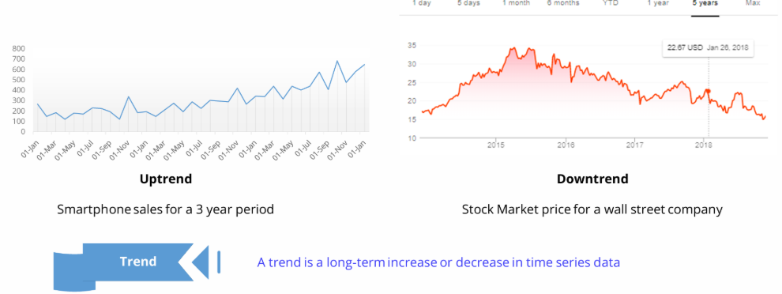
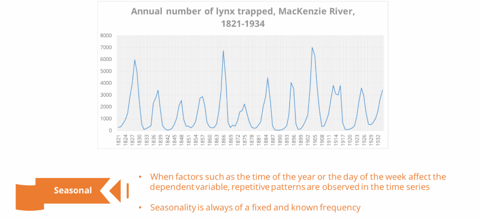
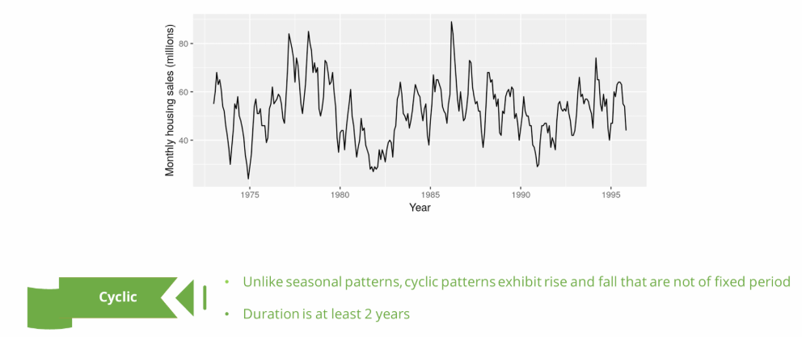
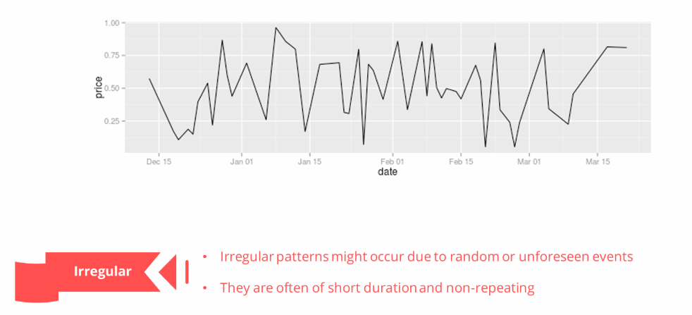
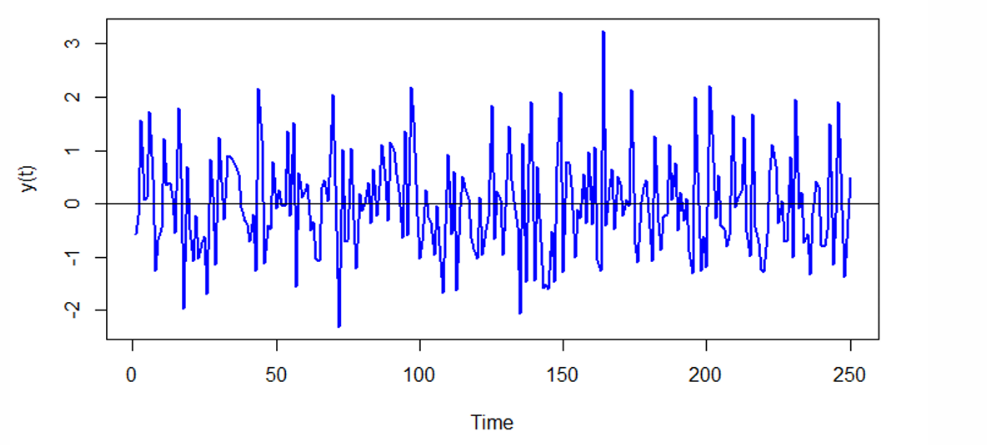
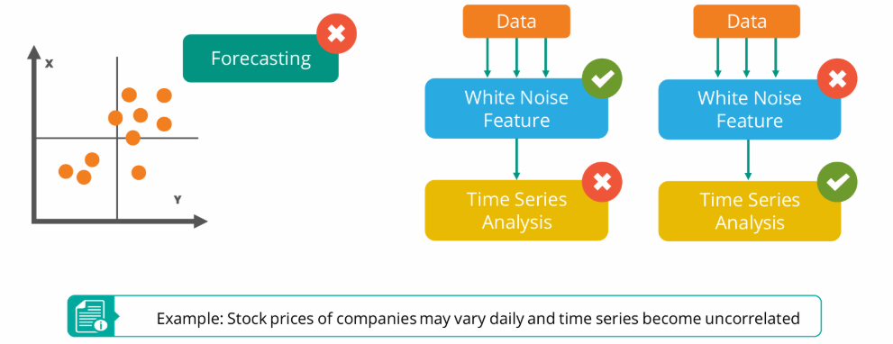
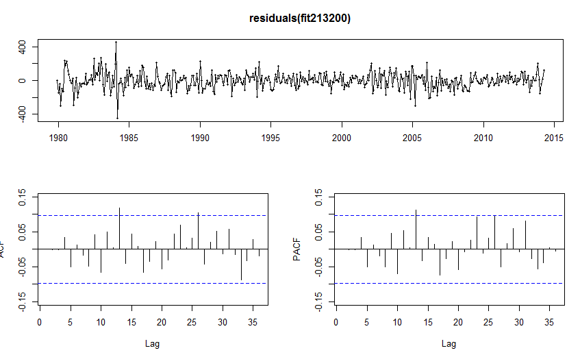

# 02 — Components of a Time Series

> **Module**: 01 Foundations | **File**: 2 of 5
>
> Any time series can be understood as the sum (or product) of distinct components. Identifying and understanding these components is the basis of all classical modeling and decomposition.

---

## Table of Contents

1. [The Four Components](#1-the-four-components)
2. [Trend](#2-trend)
3. [Seasonality](#3-seasonality)
4. [Cyclical Component](#4-cyclical-component)
5. [Remainder (Noise)](#5-remainder-noise)
6. [Additive vs. Multiplicative Decomposition](#6-additive-vs-multiplicative-decomposition)
7. [White Noise](#7-white-noise)

---

## 1. The Four Components

Any time series `Y(t)` can be expressed as a combination of up to four components:

```
Decomposition Model
-------------------

Additive model:
  Y(t) = T(t) + S(t) + C(t) + R(t)

Multiplicative model:
  Y(t) = T(t) × S(t) × C(t) × R(t)
```

| Component | Symbol | What It Captures | Typical Duration | Example |
|-----------|--------|------------------|-----------------|----------------------|
| **Trend** | T(t) | Long-run direction (up, down, flat). Long-term increase or decrease | Years to decades | Yearly growth in users |
| **Seasonal** | S(t) | Regular, fixed-period calendar patterns (Repeating patterns at fixed frequency) | Known fixed period | Weekly sales spikes on weekends |
| **Cyclical** | C(t) | Business-cycle oscillations (no fixed period) | 2–10 years | Business cycles |
| **Remainder** | R(t) | Random noise after removing all structure (Random, unpredictable variation)| — | Noise / Irregular

> **In practice**, classical decomposition treats T(t) and C(t) as a combined "trend-cycle" component, since they are difficult to separate without very long series.

---

## 2. Trend

### 2.1 What Is Trend?

The **trend** is the **long-run, systematic direction** of the series — reflecting underlying growth, decline, or stability over a long time window.



#### Examples of Trends in Different Fields

- **Economics & Finance**
  - Stock Market: The general upward (or downward) movement of a stock's price over several years.
  - Unemployment Rates: A long-term decline in unemployment rates during an economic expansion.

- **Environment & Climate**
  - Climate Change: The gradual increase in Earth's average temperature over decades.
  - Population Growth: Increasing human or animal populations over generations (e.g., tiger populations).

- **Business & Sales**
  - Product Sales: A continuous rise in unit sales for a popular product due to market awareness.
  - E-commerce Growth: The steady, long-term increase in online sales volume.

- **Technology**
  - Internet Usage: The exponential growth in internet users over time.
  - Social Media: A new song becoming "trending" for a period before fading, showing a temporary trend.


#### Characteristics
- **Long-Term Movement**: Trends represent the slowest, most significant movement in data, lasting years or decades.
- **Directional**: Can be upward (positive), downward (negative), or stationary (flat).
- **Not Fixed Frequency**: Unlike seasonality, trends don't repeat at fixed intervals; they show persistent change.

### 2.2 Types of Trend

| Type | Equation | Example |
|------|----------|---------|
| **Linear** | `T(t) = α + β·t` | Steady year-on-year revenue growth |
| **Exponential** | `T(t) = α · eᵝᵗ` | Population growth, early-stage tech adoption |
| **Logistic (S-curve)** | `T(t) = L / (1 + e^{-k(t-t₀)})` | Product adoption — grows fast then saturates |
| **Polynomial** | `T(t) = α + β₁t + β₂t²` | More flexible non-linear trends |
| **Piecewise** | Different slopes in different periods | Revenue before/after a major market event |
| **Flat (no trend)** | `T(t) = μ` (constant) | Stationary series |

### 2.3 Identifying Trend

```
Visual signs:
  ✓ Raw series plot clearly drifts upward or downward over time
  ✓ Rolling mean (long window) is not flat
  ✓ Linear regression of Y on time index has a significant slope (β ≠ 0)
  ✓ ADF test fails to reject the null → likely trend present
```

### 2.4 Removing Trend

| Method | When to Use |
|--------|-------------|
| **First differencing** `ΔY(t) = Y(t) - Y(t-1)` | Linear trend (most common) |
| **Log transform** `log(Y(t))` | Exponential trend + stabilizes variance |
| **Polynomial detrending** | Quadratic or polynomial trend |
| **Moving average subtraction** | Remove smooth trend without differencing |

```python
# First differencing (most common for linear trend)
series_detrended = series.diff().dropna()

# Log transform then difference (for exponential trend)
import numpy as np
series_log_diff = np.log(series).diff().dropna()
```

---

## 3. Seasonality

### 3.1 What Is Seasonality?

**Seasonality** is a **regular, repeating pattern** that occurs at a **known, fixed period** `s`.



> Key property: the period is **exactly known and fixed**.
> Monday is always after Sunday. January always follows December.
> This is what distinguishes seasonality from cyclicality.

#### Examples of Seasonality by Interval

- **Yearly**
  - Retail: High sales for gifts in December, increased demand for swimwear in summer.
  - Tourism: More visitors to ski resorts in winter and beach destinations in summer.
  - Agriculture: Sales peaking during harvest seasons.
  - Health: Flu cases rising in winter.

- **Weekly**
  - Retail: Higher sales on weekends compared to weekdays.
  - Traffic: Increased congestion during weekday rush hours (morning/evening).
  - Call Centers: More calls during business hours, fewer at night.

- **Daily**
  - Energy Consumption: Peaks in electricity usage in the mornings and evenings as people wake up and return home.
  - Retail: Higher foot traffic in stores during lunch and after work hours.


#### Characteristics
- **Predictable**: Patterns repeat at fixed, known intervals (e.g., every 12 months, every 7 days).
- **Caused by External Factors**: Driven by seasons, calendars, weather, or social habits.
- **Different from Cycles**: Unlike seasonality, cyclical patterns (like economic booms/busts) occur over irregular, longer periods.


### 3.2 Examples by Domain

| Domain | Seasonal Pattern | Period `s` |
|--------|-----------------|-----------|
| Retail | Weekly shopping patterns | 7 |
| Retail | Christmas / holiday surge | 365 |
| Energy | Overnight/daytime consumption | 24 |
| Energy | Weekday vs. weekend usage | 168 (hourly) |
| Tourism | Summer/winter peaks | 12 (monthly) |
| Finance | Quarter-end effects | 4 (quarterly) |

### 3.3 Multiple Seasonality

Many real-world series have **more than one** seasonal period simultaneously.

**Examples:**
- Hourly electricity demand → `s₁ = 24` (daily) + `s₂ = 168` (weekly)
- Minute-level traffic data → `s₁ = 1440` (daily) + `s₂ = 10080` (weekly)

Models that handle multiple seasonality:
- **TBATS** — Trigonometric Box-Cox ARMA Trend Seasonal
- **Prophet** — Facebook's model with Fourier series for seasonality
- **MSTL** — Multiple STL decomposition
- **Neural models** — TFT, N-BEATS, LSTMs naturally handle multiple patterns

### 3.4 Additive vs. Multiplicative Seasonality

```
Additive seasonality:   Y(t) = T(t) + S(t) + R(t)
  → Seasonal amplitude is CONSTANT regardless of the level of the series
  → Example: ±100 units every December, whether total sales are 500 or 5000

Multiplicative seasonality:  Y(t) = T(t) × S(t) × R(t)
  → Seasonal amplitude GROWS proportionally with the level
  → Example: +20% every December, so spikes are larger when the series is larger
```

**How to tell which applies:**

```
Plot the series. If the seasonal swings get bigger as the series grows → Multiplicative
                 If seasonal swings stay the same size → Additive

Shortcut: log-transform a multiplicative series to make it additive:
  log(Y(t)) = log(T(t)) + log(S(t)) + log(R(t))
```

### 3.5 Identifying Seasonality

```python
# Visual: Seasonal subseries plot
from statsmodels.graphics.tsaplots import month_plot, quarter_plot
month_plot(series)   # For monthly data — shows each month's values across years

# ACF: Seasonal spikes appear at lags s, 2s, 3s...
from statsmodels.graphics.tsaplots import plot_acf
plot_acf(series, lags=50)   # Look for significant spikes at multiples of s
```

### 3.6 Removing Seasonality

```python
# Seasonal differencing (removes seasonality of period s)
s = 12   # for monthly data
series_seasonal_diff = series.diff(s).dropna()

# Or: subtract the seasonal component from STL decomposition
from statsmodels.tsa.seasonal import STL
result = STL(series, period=12).fit()
series_deseasonalized = series - result.seasonal
```

---

## 4. Cyclical Component

### 4.1 What Is the Cyclical Component?

The **cyclical component** represents long-run oscillations **without a fixed, known period** — typically driven by economic or business cycles.



#### Examples of Cyclical Patterns

- **Business Cycles**: Periods of economic growth (prosperity) followed by contraction (recession, depression) and recovery, occurring over several years with irregular timing (e.g., recessions in the 70s, 80s, 90s).
- **Housing Market Cycles**: "Boom and bust" patterns in real estate, with long periods of rising prices followed by downturns.
- **Commodity Prices**: Fluctuations in prices for oil, metals, or agricultural goods, influenced by supply, demand, and global events.
- **Product Life Cycles**: Adoption and decline in demand for a specific product, influenced by trends and innovation.
- **Fashion Trends**: Cycles of popularity for certain styles, often shorter but still irregular.


#### Key Characteristics
- **Variable Duration**: Unlike fixed seasonal patterns (e.g., yearly), cycle lengths (3–12 years for business cycles) are not precise.
- **External Factors**: Driven by macro-economic forces, consumer confidence, or industry shifts.
- **Combination with Other Patterns**: Can occur alongside trends (long-term direction) and seasonality (fixed-period patterns).

### 4.2 Seasonality vs. Cyclicality

| Property | Seasonality | Cyclicality |
|----------|-------------|-------------|
| **Period** | Fixed and known | Unknown, variable |
| **Duration** | Usually < 1 year | Usually 2–10 years |
| **Regularity** | Highly regular | Irregular, varying length |
| **Example** | Christmas sales peak in December | Economic recession |
| **Predictability** | Highly predictable | Hard to forecast |

### 4.3 Practical Handling

In most applied work, the cyclical component is:
- **Folded into the trend** (called "trend-cycle") in decomposition
- **Not explicitly modeled** unless you have economic indicators as covariates
- Relevant in **macro-economic forecasting** and **business planning** contexts

Tools for cyclical analysis:
- **Hodrick-Prescott (HP) filter** — separates trend and cycle
- **Band-pass filters (Baxter-King)** — isolate business cycle frequencies
- **VAR with economic indicators** — model cyclical effects via external variables

---

## 5. Remainder (Noise)

### 5.1 What Is the Remainder?

The **remainder** (also called residual, error, or irregular component) is what's left after removing all structural components:

```
Additive:        R(t) = Y(t) - T(t) - S(t)
Multiplicative:  R(t) = Y(t) / (T(t) × S(t))
```




An irregularity in a time series means data points aren't collected at consistent intervals, like stock trades (happening constantly but unevenly) or event logs (e.g., sensor alerts only when thresholds are hit).

- **Financial Markets**: Stock trades recorded at the millisecond, not every second.
- **IoT/Sensors**: A smart meter sending data only when power usage spikes or a battery runs low.
- **Healthcare**: Patient vitals recorded during a checkup or emergency, not every hour.
- **Astronomy**: Observations dependent on weather, telescope time, and celestial alignment.
- **Natural Disasters**: Earthquakes or floods occurring at unpredictable times.

These irregular patterns differ from regular series (like daily temperatures) by having varying time gaps between data points, often requiring special handling for analysis.

### 5.2 Properties of a Good Remainder

A well-decomposed series should leave a remainder that looks like **white noise**:

| Property | Ideal Remainder |
|----------|----------------|
| Mean | Zero (or near zero) |
| Variance | Constant over time (homoskedastic) |
| Autocorrelation | None at any lag |
| Distribution | Approximately Gaussian (for most models) |

```python
# Test remainder for white noise
from statsmodels.stats.diagnostic import acorr_ljungbox
result = acorr_ljungbox(remainder, lags=[10, 20], return_df=True)
# p-value > 0.05 → residuals look like white noise ✅
```

### 5.3 When the Remainder Has Structure

If the remainder still shows autocorrelation or patterns:
- The decomposition was **underfitting** (e.g., wrong period, too little smoothing)
- There is **additional signal** that a model can exploit (e.g., ARMA structure in the residuals)
- There may be **multiple seasonalities** not captured

---

## 6. Additive vs. Multiplicative Decomposition

### 6.1 Summary

```
Additive:        Y(t) = T(t) + S(t) + R(t)
  → Components are on the same scale as the original series
  → Appropriate when seasonal amplitude is CONSTANT

Multiplicative:  Y(t) = T(t) × S(t) × R(t)
  → Seasonal component is a ratio/proportion (e.g., 1.15 = 15% above trend)
  → Appropriate when seasonal amplitude GROWS with trend
```

### 6.2 Decision Guide

```
Step 1: Plot the series
Step 2: Does the height of the seasonal peaks grow as the series grows?
        YES → Multiplicative (or log-transform then use additive)
        NO  → Additive
```

### 6.3 Converting Multiplicative to Additive

```python
import numpy as np

# Log transform converts multiplicative → additive
series_log = np.log(series)

# Decompose in log space (additive)
from statsmodels.tsa.seasonal import STL
result = STL(series_log, period=12).fit()

# Back-transform with exp()
trend_original    = np.exp(result.trend)
seasonal_original = np.exp(result.seasonal)
```

### 6.4 Choosing in Code

```python
from statsmodels.tsa.seasonal import seasonal_decompose

# Additive
result_add = seasonal_decompose(series, model='additive', period=12)

# Multiplicative
result_mul = seasonal_decompose(series, model='multiplicative', period=12)

result_add.plot()
result_mul.plot()
```

---

## 7. White Noise

### 7.1 Definition

A white noise series is one with a **zero mean,** a **constant variance**, and **no correlation** between its values at different times.



A **white noise** process `{ε_t}` satisfies:

```
E[ε_t]         = 0             (zero mean)
Var[ε_t]       = σ²            (constant variance)
Cov[ε_t, ε_s]  = 0  for t ≠ s  (no autocorrelation)
```

If `ε_t ~ N(0, σ²)` additionally, it is **Gaussian white noise**.

An example of white noise in time series is the random fluctuation of stock market returns after accounting for trends/seasonality, or the unpredictable errors (residuals) from a fitted forecasting model, characterized by no patterns, zero autocorrelation, constant mean/variance, making it impossible to predict future values from past ones, like a TV static sound.



### 7.2 Key Characteristics
- **Randomness**: No discernible pattern; past values don't predict future ones.
- **Independence**: Observations are independent and identically distributed (i.i.d.).
- **Stationary**: Constant mean (often zero) and constant variance over time.
- **No Autocorrelation**: The correlation between a value and its lagged values is zero.

#### Why It Matters?

- White noise is **unpredictable** — no model can improve on forecasting its mean
- Residuals of a good model should be white noise
- If they are not, you have **unexploited structure** in the data

### 7.3 Practical Examples
- **Model Residuals**: After fitting a model (like ARIMA) to data (e.g., sales), the leftover errors (residuals) should ideally look like white noise, meaning the model captured all patterns.
- **Simulated Data**: A sequence of random numbers drawn from a normal distribution with a mean of 0 and constant variance is a perfect Gaussian white noise example.
- **Financial Data (After Transformation)**: Daily percentage changes (returns) in a stock price, once trends are removed, often approximate white noise, indicating price movements are unpredictable.


### 7.4 How to Identify It
- **Time Plot**: Shows scattered points around a constant mean with no visible patterns or trends.
- **ACF Plot (Autocorrelation Function)**: Spikes should mostly fall within calculated confidence bands (e.g., ±2/√T), indicating no significant correlation at different lags.



#### Testing for White Noise

```python
# Visual: ACF plot — all bars inside the confidence band
from statsmodels.graphics.tsaplots import plot_acf
plot_acf(residuals, lags=40)

# Formal: Ljung-Box test
from statsmodels.stats.diagnostic import acorr_ljungbox
lb = acorr_ljungbox(residuals, lags=20, return_df=True)
print(lb[['lb_stat', 'lb_pvalue']])
# All p-values > 0.05 → white noise ✅
```

---

*← [01 — What is Time Series](./01_what_is_time_series.md) | [Module README](./README.md) | Next: [03 — Stationarity](./03_stationarity.md) →*
